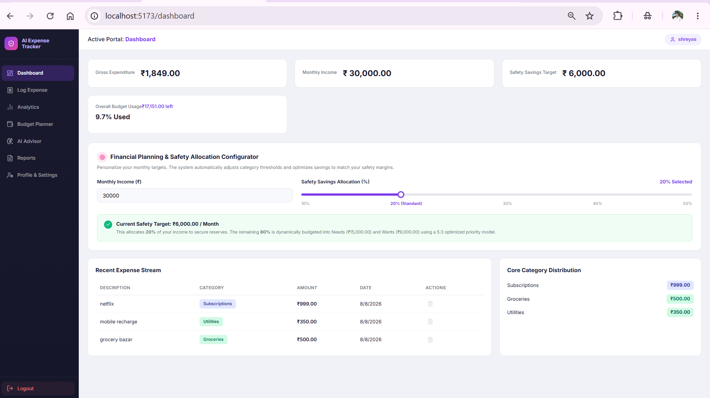
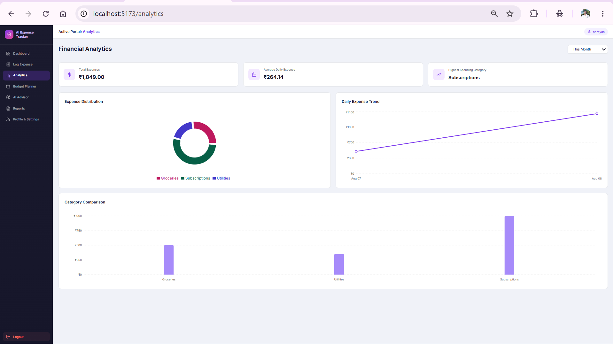
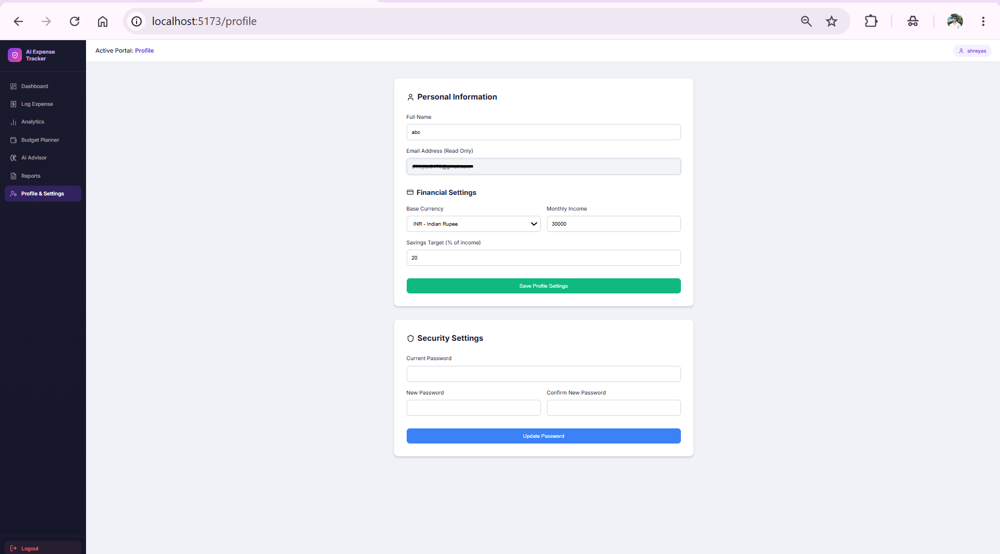

# Personal-Expense-Tracker
I recently built a full-stack web application to help users take control of their finances with smart analytics and budgeting tools!

A modern, full-stack web application designed to help users manage their finances intelligently. The platform features interactive financial analytics, AI-assisted budget forecasting, and PDF report generation.

## 🚀 Features

- **Dashboard & Analytics:** Interactive charts and graphs for visualizing expenses (powered by Recharts).
- **AI Budget Advisor:** Machine learning-driven budget forecasting to help users plan ahead.
- **Exportable Reports:** Generate and download monthly expense reports as PDFs.
- **Secure Authentication:** User login and registration system.
- **Fast & Responsive UI:** Built with modern React and Vite for optimal performance.

## 🛠️ Tech Stack

### Frontend
- **React.js** (via Vite)
- **Recharts** (Data Visualization)
- **Lucide React** (Icons)
- **Axios** (API requests)
- **jsPDF & html2canvas** (PDF generation)

### Backend
- **Python 3.11**
- **FastAPI** (High-performance web framework)
- **SQLAlchemy** (Asynchronous ORM)
- **PostgreSQL** (Hosted via Supabase)
- **Uvicorn** (ASGI server)
- **Pydantic** (Data validation)

## 💻 Getting Started

### Prerequisites
- Node.js (v18+)
- Python (3.8 - 3.11)
- PostgreSQL database (or a Supabase project)

### 1. Backend Setup

Navigate to the backend directory:
`cd backend`

Create and activate a virtual environment:
`python -m venv venv`

**On Windows:**
`.\venv\Scripts\activate`

**On macOS/Linux:**
`source venv/bin/activate`

Install dependencies:
`pip install -r requirements.txt`

Configure your environment variables:
- Copy `.env.example` to `.env`
- Update the database credentials to point to your PostgreSQL instance.

Start the API server:
`uvicorn app.main:app --reload`
*The backend will run on `http://127.0.0.1:8000`. You can access the API documentation at `http://127.0.0.1:8000/docs`.*

### 2. Frontend Setup

Navigate to the frontend directory:
`cd frontend`

Install dependencies:
`npm install`

Configure your environment variables:
- Copy `.env.example` to `.env`
- Ensure the API URL points to your running backend (e.g., `http://127.0.0.1:8000`).

Start the development server:
`npm run dev`
*The frontend will run on `http://localhost:5173`.*

## 📸 Screenshots

### Dashboard

### Analytics

### Budget Planner

### Profile

## 🤝 Contributing
Contributions, issues, and feature requests are welcome!

