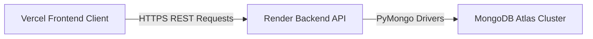

# 🚀 Production Deployment Guide

This guide details the step-by-step instructions for deploying the **Personal Expense Tracker** application to production using **Vercel** (for the frontend React client) and **Render** (for the backend FastAPI ML engine).

---

## 🎨 Architecture Overview

---

## ⚛️ Frontend Deployment on Vercel

Vercel is the recommended hosting provider for your React frontend application.

### Step 1: Import Project to Vercel
1. Log in to your [Vercel Dashboard](https://vercel.com).
2. Click **Add New** > **Project**.
3. Import your GitHub repository containing the **Personal Expense Tracker** workspace.

### Step 2: Configure Project Settings
- **Framework Preset**: `Vite` (automatically detected)
- **Root Directory**: `frontend` (Ensure you set this to the `frontend` subdirectory!)
- **Build Command**: `npm run build`
- **Output Directory**: `dist`

### Step 3: Add Environment Variables
Expand the **Environment Variables** section and add:
- **Key**: `VITE_API_URL`
- **Value**: `https://your-backend-app.onrender.com` (Your deployed Render backend URL)

### Step 4: Click Deploy!
Vercel will build your assets and generate a production URL like `https://personal-expense-tracker-frontend.vercel.app`.

---

## 🐍 Backend Deployment on Render

Render is the ideal platform for running your Python FastAPI backend and loading ML scikit-learn models.

### Step 1: Create a Render Web Service
1. Log in to your [Render Dashboard](https://render.com).
2. Click **New** > **Web Service**.
3. Connect your GitHub repository.

### Step 2: Configure Web Service Settings
- **Name**: `personal-expense-tracker-backend`
- **Region**: Select a region closest to your users.
- **Runtime**: `Python 3`
- **Root Directory**: `backend` (Ensure you set this to the `backend` subdirectory!)
- **Build Command**: `pip install -r requirements.txt`
- **Start Command**: `uvicorn app.main:app --host 0.0.0.0 --port $PORT`

### Step 3: Add Environment Variables
Open the **Environment** tab in Render and add the following variables:
- **`MONGODB_URL`**: `mongodb+srv://<username>:<password>@cluster0.abcde.mongodb.net/expense_db?retryWrites=true&w=majority` (Your MongoDB Atlas connection string)
- **`JWT_SECRET_KEY`**: A secure 32-character random string (e.g., generated using `openssl rand -hex 32`)
- **`ENVIRONMENT`**: `production`
- **`CORS_ORIGINS`**: `["https://your-frontend-app.vercel.app"]` (Whitelists your deployed Vercel domain to prevent browser CORS blockages)

---

## 🛡️ Database Resiliency

### Cloud MongoDB Atlas
1. Set up a free-tier M0 cluster on [MongoDB Atlas](https://www.mongodb.com/cloud/atlas).
2. Whitelist Render's server IP or allow access from anywhere (`0.0.0.0/0`) under Atlas Network Access settings.
3. Supply your connection URI to Render's `MONGODB_URL` environment variable.

### Automatic Local Fallback
If MongoDB Atlas goes offline, the backend's resilient database engine (`DatabaseManager`) will automatically activate localized JSON storage using `mock_database.json` to keep your system fully online and operating.
